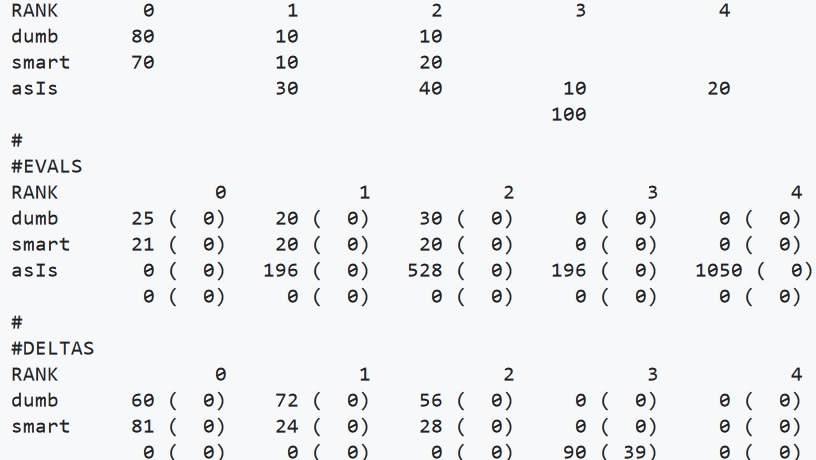

# 🎯 **Random Guessing Experiment**

## 🚀 **Overview**

This experiment aims to test the validity of the following hypotheses about the effectiveness of random guessing in predictive models:

1. **For low-dimensional problems (fewer than 6 attributes)**: Random guessing performs as well as, or better than, sophisticated methods.
2. **For higher-dimensional problems (6 or more attributes)**: Random guessing becomes ineffective and performs much worse than other methods.

---

## 📊 **Summary of Results**

- **Low-dimensional data (< 6 attributes)**: Random guessing outperforms advanced techniques, ranking best in a significant number of cases.
- **High-dimensional data (≥ 6 attributes)**: Random guessing's performance deteriorates, often equivalent to doing nothing (the baseline method).

---

## ⚙️ **Pre-requisites**

To run the code, **Python 3.13** is required. This project is built on [`ezr.py`](https://github.com/timm/ezr/tree/24Aug14).

### Python 3.13 Installation

1. **For Linux/macOS**:
   ```bash
   sudo apt update
   sudo apt install python3.13
2. For Windows: Download the installer from python.org and follow the setup instructions.

## 🧪 **Experimentation Steps**

### Step 1: Clone the repository and navigate to the working directory
```bash
cd hw

### Step 2: Divide the dataset into small (< 6 attributes) and large datasets
```bash
sudo make divide

### Step 3: Generate bash scripts to run experiments for small and large datasets
```bash
sudo make Exp_dir=greater_than_or_equals_6 Act=randvsezr act > scripts/randvsezrlarge.sh
sudo make Exp_dir=less_than_6 Act=randvsezr act > scripts/randvsezrsmall.sh

### Step 4: Make the scripts executable and run them
```bash
chmod +x scripts/randvsezrlarge.sh
chmod +x scripts/randvsezrsmall.sh
bash scripts/randvsezrlarge.sh
bash scripts/randvsezrsmall.sh

### Step 5: Generate combined results for small and large datasets
Navigate to the results directory and run the `rq.sh` script from the `ezr` project.

Example for large datasets:
```bash
cd output/randvsezr/greater_than_or_equals_6
bash /workspaces/HW3/ezr_24Aug14/etc/rq.sh

## 📈 **Results**

### Small Dataset Results (< 6 attributes)


In **small datasets**, random guessing (denoted as `dumb`) ranks at position 0 (best) in **80%** of cases. This is even higher than more advanced techniques like active learning, which ranks at 0 in **70%** of cases, proving the efficacy of random guessing for low-dimensional problems.

### Large Dataset Results (≥ 6 attributes)


In **large datasets**, random guessing ranks at 0 in **31%** fewer cases than active learning. It performs similarly to the baseline method (`asIs`), which does nothing (returns the whole dataset).

## 📝 **Conclusion**

The experiment confirms that:
- **Random guessing** is highly effective for problems with fewer than 6 attributes, consistently ranking best.
- For **high-dimensional datasets**, random guessing becomes ineffective, and its performance is comparable to baseline methods.

These findings validate the original hypotheses: random guessing excels in low dimensions but performs poorly in higher-dimensional spaces.

---

## 📁 **Project Structure**
- `hw/`: Main working directory.
- `hw/scripts/`: Contains generated bash scripts for running experiments.
- `output/`: Contains results.
- `ezr_24Aug14/`: External dependency for experiment processing.

## 📜 **License**
This project is licensed under the MIT License. See the [LICENSE](LICENSE) file for details.

---

## 🧑‍💻 **Contributors**
- [Kishan Kumar Ganguly](https://github.com/KKGanguly)

Feel free to open issues or submit pull requests for improvements!


